# lumin

A ray tracer written from scratch in Rust, plus a gallery of renderers that
deliberately get the physics *wrong* on purpose.

The honest half is a fairly standard Whitted-style ray tracer: spheres and
triangle meshes, a hand-rolled OBJ loader, a BVH for acceleration, point
lights with shadow rays, Lambertian/Metal/Dielectric materials (mirror
reflection, glass refraction with Schlick's Fresnel approximation),
antialiasing, and a multithreaded render loop.

<p align="center">
  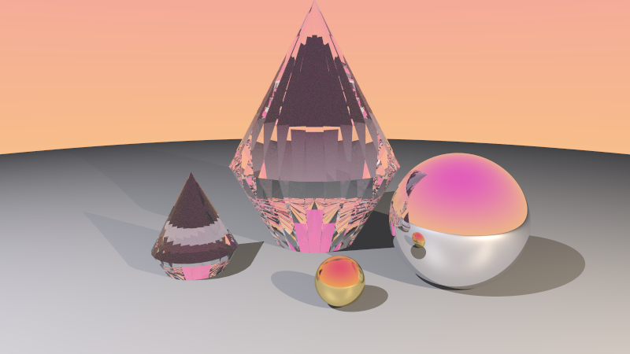
</p>

## The glitch gallery

The more interesting half. Years ago, a subtle bug in a reflection shader
produced beautiful kaleidoscope-fold artifacts in scenes with a few bounces
of light. This project chases that effect (and others like it) by
implementing a handful of plausible one-line shader bugs as selectable
render modes — see `src/glitch.rs` for the full writeup of each one.

### The real bug

The original C++ source turned up. The actual bug (`hit-chain-drift`,
`src/render.rs`) is a **variable-shadowing + shared-mutable-state** bug, not
a broken formula: a locally-declared `Vector3D rCol;` inside the
mirror-reflection branch shadows the outer accumulator of the same name, so
the recursively-computed "real" reflection color is thrown away every time.
But the hit-record used to compute that reflection is a mutable reference
that gets updated in place regardless of the discard - so the only surviving
effect of "reflecting" is that the shading point silently drifts to wherever
the reflected ray landed, across every remaining iteration of an inner
per-light sample loop, across lights, and across nested recursive calls (all
sharing one mutable hit-record and one bounce budget that only ever
decreases, never resets). The final pixel color ends up being local diffuse
lighting sampled at a chaotic, order-dependent *walk* across the scene's
geometry - not reflection at all. Textured objects make it obvious:

<p align="center">
  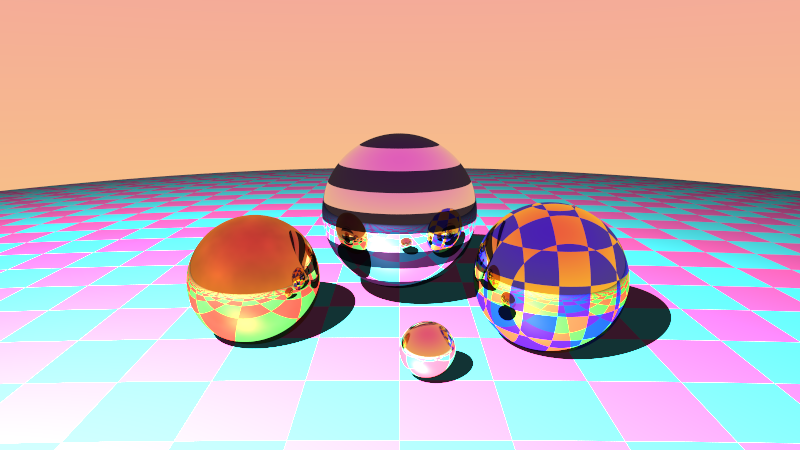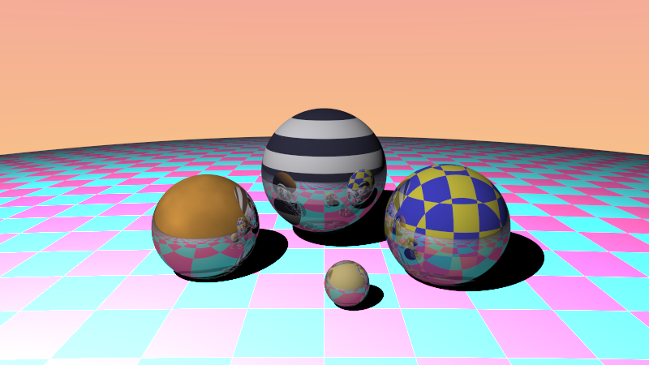
</p>

Reflective regions go flat and waxy (no real reflection color ever
substitutes for the diffuse term there), while other regions show jumbled
fragments of textures from *other objects entirely*, wherever the walk
happened to wander:

<p align="center">
  
</p>

### Other explorations

The most literal reading of "kaleidoscope" turned out to be a good creative
detour even once the real bug was known: `angular-fold` mirrors the
reflected/refracted direction's azimuthal angle into repeating wedges around
the vertical axis — the actual optical principle behind a toy kaleidoscope's
ring of mirrors, just applied to a ray direction instead of light in a tube:

<p align="center">
  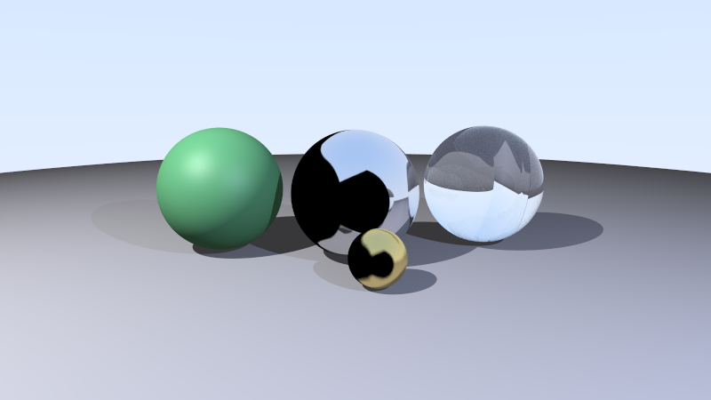
</p>

A few of the other deliberately-wrong reflection axes/formulas:

| | |
|---|---|
| 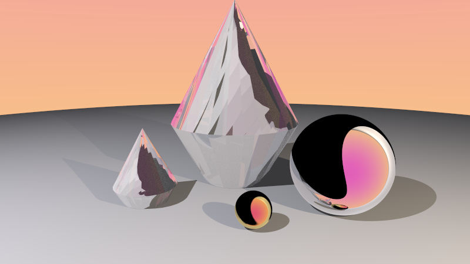 `axis-swap-reflect` — cyclically permute the reflected vector's (x,y,z) before tracing the bounce. Reads as mottled, fragmented faceting. | 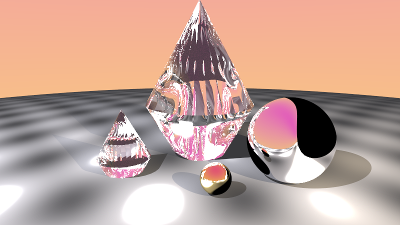 `normal-drift` — corrupt the shading normal's *length* as a smooth function of position, simulating a forgot-to-renormalize bug. Surfaces ripple and marble instead of folding. |
| 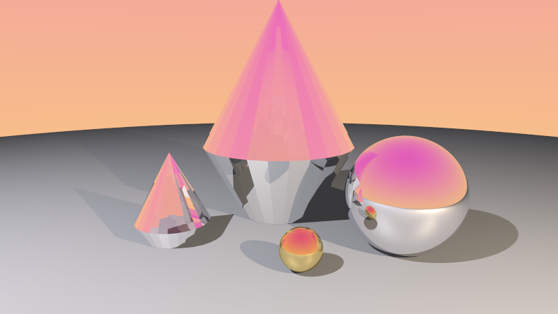 `swapped-eta` — refraction ratio computed with the front/back test flipped. Solid objects read as turned inside-out, frosted glass. | 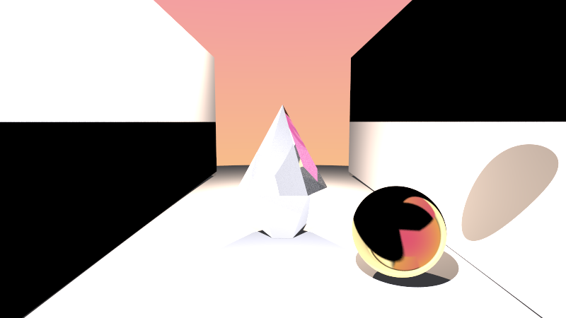 `axis-swap-reflect` down an actual mirrored corridor (`scenes/` doesn't ship this one — see `hall_of_mirrors_scene` in `src/main.rs`). Hard banded tiling. |

Other modes (`kaleidoscope-stale-direction`, `kaleidoscope-stale-normal`,
`flipped-reflect-sign`, `inverted-fresnel`, `energy-bleed`) are documented in
`src/glitch.rs` alongside the specific bug each one simulates.

### Textures

Materials can carry a procedural, world-space `Texture` instead of a flat
color: `Solid`, `Checker`, `Stripes`, `Gradient`, and `Noise` (hand-rolled
fractal value noise, no crate). World-space rather than UV-mapped, so it
works uniformly across spheres and arbitrary meshes with zero extra
plumbing - and it's what makes `hit-chain-drift`'s chaotic walk visible at
all, since a solid-colored object can't show you that its sampled point
silently moved.

### Emissive materials

`Material::Emissive { color, intensity }` radiates its own color/texture
regardless of incident light, instead of being shaded by the scene's lights.
There's no full global illumination here (this is still a Whitted-style
direct-lighting tracer), so an emissive surface doesn't cast light onto
*other* objects the way a `Light` does — but seen directly, through glass, or
in a mirror, that's enough for a glowing crystal core:

<p align="center">
  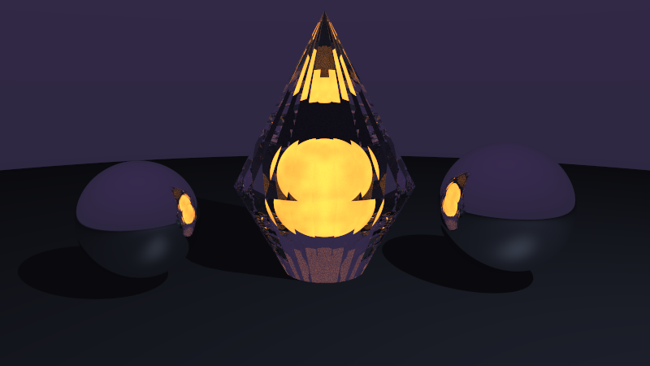
</p>

`angular-fold` (right) folds the glow's refracted path into a symmetric
petal shape entirely as a side effect of folding the reflection/refraction
angle - not something anyone designed, just what falls out of applying a
literal optical trick to a glowing object seen through glass.

### Turntable animation

`--animate <frames>` orbits the camera once around `look_at` (same height
and radius as the scene's own `look_from`) and encodes the sequence as a
looping animated GIF instead of a still:

```sh
cargo run --release -- scenes/glowing_core.ron --animate 36 --glitch angular-fold -o out.gif
```

<p align="center">
  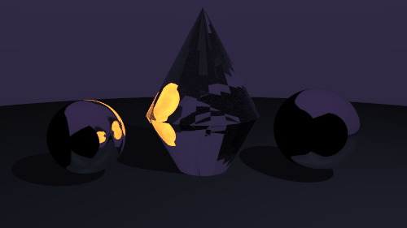
</p>

`angular-fold`'s wedge symmetry is locked to world-up, not to the camera - so
orbiting around a faceted crystal cluster reads like a slowly-turning mandala
rather than a fixed decal on the objects:

<p align="center">
  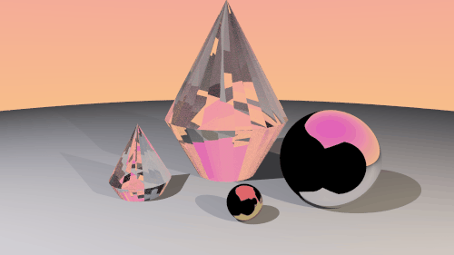
</p>

`hit-chain-drift` in motion shows a side of the bug stills don't: since it
has no real reflection to fill in a surface's dark side, whichever facets
face away from the single light in this scene go essentially silhouette-
black as the camera orbits past them, alternating with the bright chaotic
patchwork on the lit side - lighting-angle sensitivity that's authentic to
the original bug (there was never a "reflected" fill light, just this
chaotic walk of *direct* light samples), not a rendering artifact:

<p align="center">
  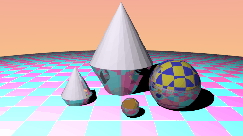
</p>

It even holds up on a real mesh - the Stanford bunny (69,451 triangles)
under `normal-drift`:

<p align="center">
  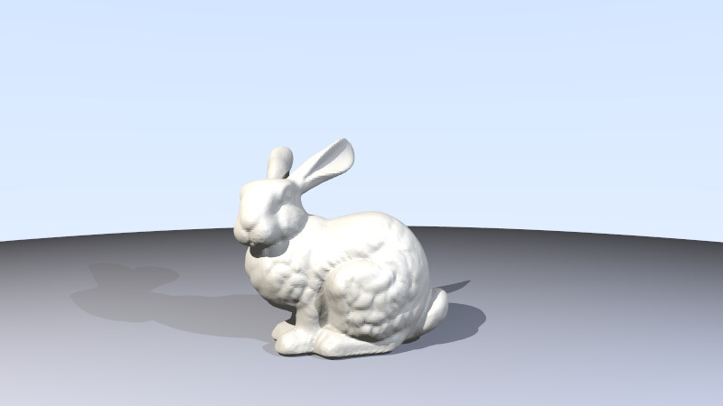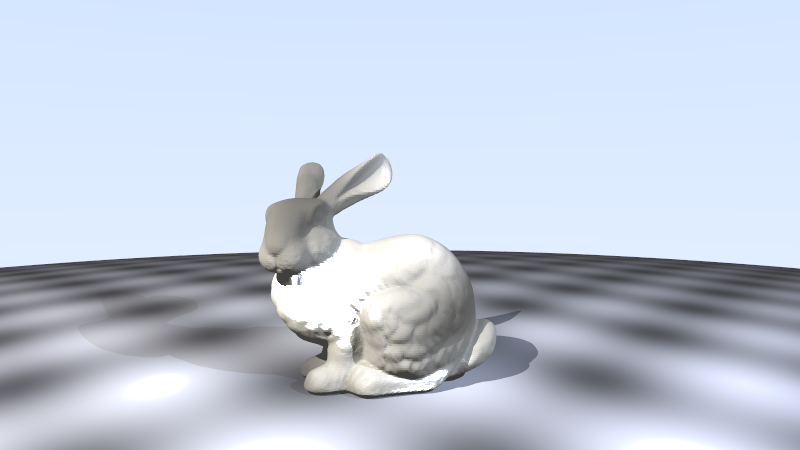
</p>

## Usage

```sh
# Build
cargo build --release

# No arguments: renders the full built-in demo (baseline scenes + every
# glitch mode) into renders/
cargo run --release

# Render a scene file
cargo run --release -- scenes/reflection_demo.ron -o renders/out.png

# ...with a specific glitch mode
cargo run --release -- scenes/crystal_showcase.ron --glitch axis-swap-reflect -o renders/out.png

# ...or every glitch mode at once, one file per mode
cargo run --release -- scenes/crystal_showcase.ron --gallery -o renders/gallery/

# ...or a looping turntable GIF, camera orbiting once around look_at
cargo run --release -- scenes/glowing_core.ron --animate 36 --glitch angular-fold -o out.gif

# Options
cargo run --release -- --help
```

Key flags: `--width`/`--height`/`--aspect`, `--samples` (antialiasing /
glass noise quality), `--depth` (max bounce count), `--glitch <mode>`,
`--animate <frames>` (turntable GIF instead of a still).

## Scene format

Scenes are [RON](https://github.com/ron-rs/ron) files - see
`scenes/*.ron` for complete examples, or `src/scene_desc.rs` for the format
definition. Shape:

```ron
(
    camera: (look_from: (0.0, 0.8, 2.5), look_at: (0.0, 0.0, -1.0), vfov: 45.0),
    sky_bottom: (1.0, 1.0, 1.0),   // optional, defaults to a pale blue sky
    sky_top: (0.5, 0.7, 1.0),      // optional
    lights: [
        Point(position: (-4.0, 5.0, 2.0), color: (1.0, 1.0, 1.0), intensity: 40.0),
    ],
    objects: [
        Sphere(center: (0.0, -100.5, -1.0), radius: 100.0, material: Lambertian(albedo: Solid((0.6, 0.6, 0.65)))),
        Sphere(center: (0.0, 0.0, -1.2), radius: 0.5, material: Metal(albedo: Checker(a: (0.9, 0.1, 0.1), b: (1.0, 1.0, 1.0), scale: 4.0), fuzz: 0.02)),
        Sphere(center: (1.1, 0.0, -1.6), radius: 0.5, material: Dielectric(ior: 1.5)),
        Mesh(path: "assets/crystal.obj", material: Dielectric(ior: 1.8), scale: 1.0, translate: (0.0, 0.0, -1.0)),
    ],
)
```

`albedo` takes a `Texture`: `Solid((r,g,b))`, `Checker(a:.., b:.., scale:..)`,
`Stripes(a:.., b:.., scale:.., axis:0|1|2)`, `Gradient(bottom:.., top:.., y0:.., y1:..)`,
or `Noise(color:.., scale:.., octaves:..)`.

## Project layout

- `src/vec3.rs`, `src/ray.rs` - core math
- `src/camera.rs`, `src/light.rs`, `src/material.rs`, `src/texture.rs`, `src/sphere.rs`, `src/triangle.rs` - scene primitives
- `src/hittable.rs`, `src/aabb.rs`, `src/bvh.rs` - intersection + acceleration structure
- `src/mesh.rs` - hand-rolled OBJ loader
- `src/scene.rs`, `src/scene_desc.rs` - runtime scene representation and its RON (de)serialization
- `src/render.rs` - the shader: recursive ray-color evaluation, antialiasing, multithreading (rayon)
- `src/glitch.rs` - the glitch gallery: every deliberate physical-inaccuracy mode, with rationale
- `examples/gen_crystal.rs` - procedurally generates the faceted "gem" test meshes under `assets/`
- `scenes/*.ron` - example scene files
- `assets/` - OBJ test meshes (procedural crystals, Stanford bunny)

## Tests

```sh
cargo test --release
```
