# lumin
A ray tracer written from scratch in Rust, plus a gallery of renderers that
deliberately get the physics *wrong* on purpose.

[Note: My GitHub username is all over the commit history, but I wrote
literally none of this, besides the ancient C++ in ./reference I gave Claude
to serve as a seed for this project, and these couple sentences. Everything
else is all AI-generated. -Anthony Brown]

The honest half is a fairly standard Whitted-style ray tracer: spheres and
triangle meshes, a hand-rolled OBJ loader, a BVH for acceleration, point and
rectangular-area lights (the latter with real soft shadows) with shadow
rays, Lambertian/Metal/Dielectric/Emissive materials (mirror reflection,
glass refraction with Schlick's Fresnel approximation), procedural and
image textures with real UV mapping, image-based environment lighting,
five camera projections plus depth of field, antialiasing, and a
multithreaded render loop. Skip to whichever section covers what you're
looking for: [glitch gallery](#the-glitch-gallery) ·
[textures](#textures) · [environment lighting](#environment-lighting) ·
[area lights](#area-lights-and-soft-shadows) ·
[emissive materials](#emissive-materials) ·
[camera projections](#camera-projections) ·
[depth of field](#depth-of-field) ·
[inside the geometry](#inside-the-geometry) · [capstone](#capstone) ·
[scene format](#scene-format) · [project layout](#project-layout).

<p align="center">
  
</p>

## The glitch gallery

The more interesting half. Years ago, a subtle bug in a reflection shader
produced beautiful kaleidoscope-fold artifacts in scenes with a few bounces
of light. This project chases that effect (and others like it) by
implementing a handful of plausible one-line shader bugs as selectable
render modes — see `src/glitch.rs` for the full writeup of each one.

### The real bug

The original C++ source turned up. The actual bug (`hit-chain-drift`,
`src/render.rs`) is a **variable-shadowing + shared-mutable-state** bug, not
a broken formula: a locally-declared `Vector3D rCol;` inside the
mirror-reflection branch shadows the outer accumulator of the same name, so
the recursively-computed "real" reflection color is thrown away every time.
But the hit-record used to compute that reflection is a mutable reference
that gets updated in place regardless of the discard - so the only surviving
effect of "reflecting" is that the shading point silently drifts to wherever
the reflected ray landed, across every remaining iteration of an inner
per-light sample loop, across lights, and across nested recursive calls (all
sharing one mutable hit-record and one bounce budget that only ever
decreases, never resets). The final pixel color ends up being local diffuse
lighting sampled at a chaotic, order-dependent *walk* across the scene's
geometry - not reflection at all. Textured objects make it obvious:

<p align="center">
  
</p>

Reflective regions go flat and waxy (no real reflection color ever
substitutes for the diffuse term there), while other regions show jumbled
fragments of textures from *other objects entirely*, wherever the walk
happened to wander:

<p align="center">
  
</p>

The source's *other* function, `mapLightRay` (evidently a forward light-
tracing/photon-mapping entry point - never fully ported, that's a different
architecture from this backward ray tracer), has its own bugs worth stealing
on their own: `coin-flip-miss` dots the incident ray direction against the
normal *without negating it first*, so ordinary front-lit surfaces go dark
and only grazing/back-facing geometry lights up; bounces terminate on an
unweighted coin flip instead of properly-weighted Russian roulette, so
brightness varies noisily sample to sample; and a reflection ray that hits
nothing returns an unclamped `(-1,-1,-1)` sentinel that bleeds through the
recursive math instead of getting corrected. The result: sparkling salt-and-
pepper noise and eclipse-like crescent rim lighting where surfaces would
normally read as flat-shaded:

<p align="center">
  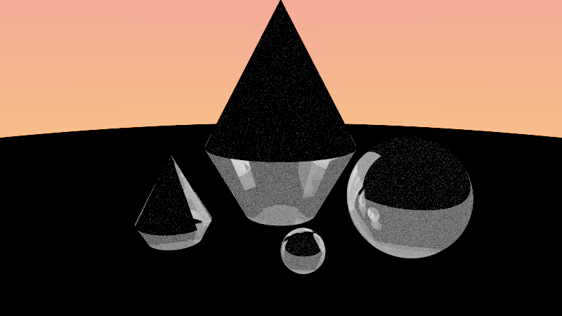
</p>

### Other explorations

The most literal reading of "kaleidoscope" turned out to be a good creative
detour even once the real bug was known: `angular-fold` mirrors the
reflected/refracted direction's azimuthal angle into repeating wedges around
the vertical axis — the actual optical principle behind a toy kaleidoscope's
ring of mirrors, just applied to a ray direction instead of light in a tube:

<p align="center">
  
</p>

A few of the other deliberately-wrong reflection axes/formulas:

| | |
|---|---|
|  `axis-swap-reflect` — cyclically permute the reflected vector's (x,y,z) before tracing the bounce. Reads as mottled, fragmented faceting. |  `normal-drift` — corrupt the shading normal's *length* as a smooth function of position, simulating a forgot-to-renormalize bug. Surfaces ripple and marble instead of folding. |
|  `swapped-eta` — refraction ratio computed with the front/back test flipped. Solid objects read as turned inside-out, frosted glass. |  `axis-swap-reflect` down an actual mirrored corridor (`scenes/` doesn't ship this one — see `hall_of_mirrors_scene` in `src/main.rs`). Hard banded tiling. |

Other modes (`kaleidoscope-stale-direction`, `kaleidoscope-stale-normal`,
`flipped-reflect-sign`, `inverted-fresnel`, `energy-bleed`) are documented in
`src/glitch.rs` alongside the specific bug each one simulates.

### Textures

Materials can carry a procedural, world-space `Texture` instead of a flat
color: `Solid`, `Checker`, `Stripes`, `Gradient`, and `Noise` (hand-rolled
fractal value noise, no crate). World-space rather than UV-mapped, so it
works uniformly across spheres and arbitrary meshes with zero extra
plumbing - and it's what makes `hit-chain-drift`'s chaotic walk visible at
all, since a solid-colored object can't show you that its sampled point
silently moved.

A `Texture::Image` variant maps an actual photo instead, which does need
real UV coordinates - `HitRecord` carries `u`/`v` now, `Sphere` computes
standard spherical UV, and the OBJ loader parses `vt` and barycentrically
interpolates it across triangles (meshes with no `vt` data default to
`(0, 0)`, which reads as one corner pixel tiled everywhere). Bilinearly
filtered, tiles beyond `[0, 1]`. All three procedural generators emit their
own natural UV now too: `gen_crystal.rs` and `gen_spiral_horn.rs` use
cylindrical mapping (`u` around the axis/tube, `v` along the height/spine),
`gen_geode.rs` uses the same spherical formula as `Sphere` but keyed to each
vertex's *undisplaced* unit direction, so the radial bumps don't skew the
mapping. A public-domain NASA Blue Marble composite lines up exactly with
the sphere mapping:

<p align="center">
  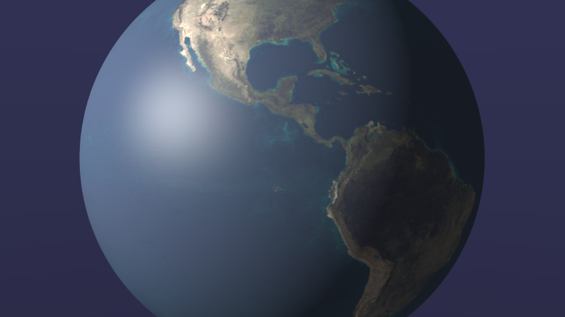
</p>

The same photo on a sphere, the faceted crystal, and the spiral horn, side
by side and wrapped along its own length respectively - each mesh's own UV
parametrization doing something visibly different with the same image:

<p align="center">
  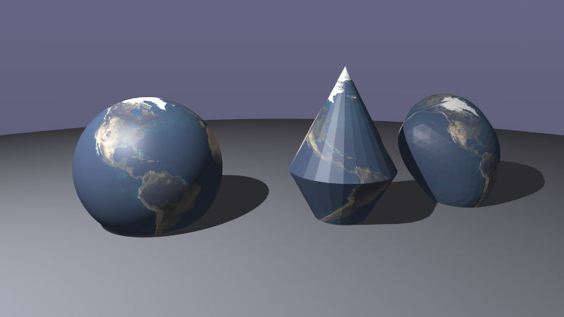
</p>
<p align="center">
  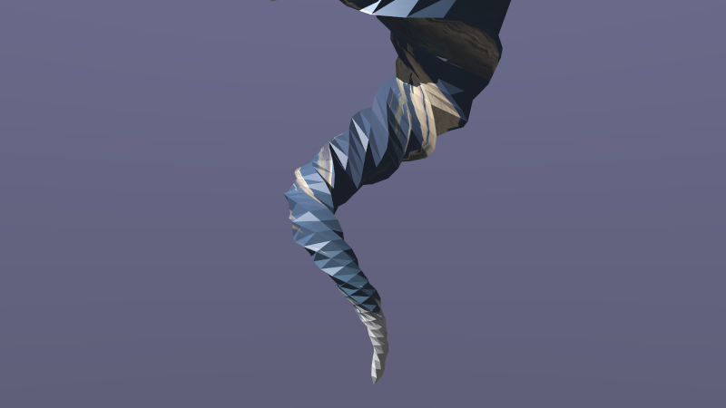
</p>

And, closing the loop: the actual 2013 photo that started this whole
project (see "The real bug" above), mapped onto a sphere right next to this
renderer's own from-scratch faceted crystal:

<p align="center">
  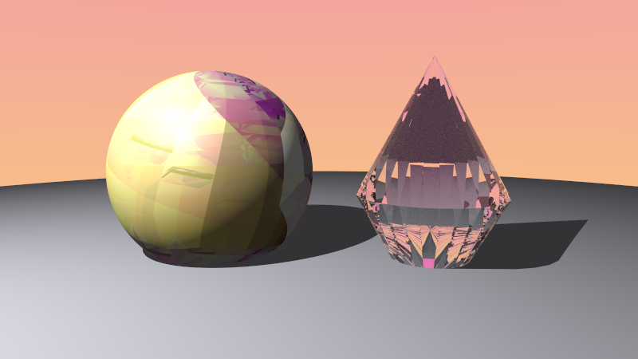
</p>

### Environment lighting

A `Scene` can carry an optional `environment: Texture`, sampled by ray
direction (same spherical UV as `Sphere`) anywhere a ray escapes the scene
with no geometry hit, overriding the flat two-color sky gradient. Since it's
just a `Texture`, any variant works - an image, or a procedural one.

Rather than reach for another found photo (public-domain sourcing is the
hard part, not the code), the showcase environment is entirely hand-rolled:
`examples/gen_starfield.rs` bakes an equirectangular nebula/starfield by
reusing this renderer's own hash-based value noise (`texture::turbulence`),
evaluated in 3D on the sphere itself (not in 2D image space) so the
u-wraparound seam and both poles come out seamless for free. A domain-warped
turbulence field drives cloud density and a second, independent lattice
scatters stars, both fed through a continuous three-stop color ramp.

No ground plane, nothing to block it - every reflective and refractive
surface picks up the nebula's color and stars directly:

<p align="center">
  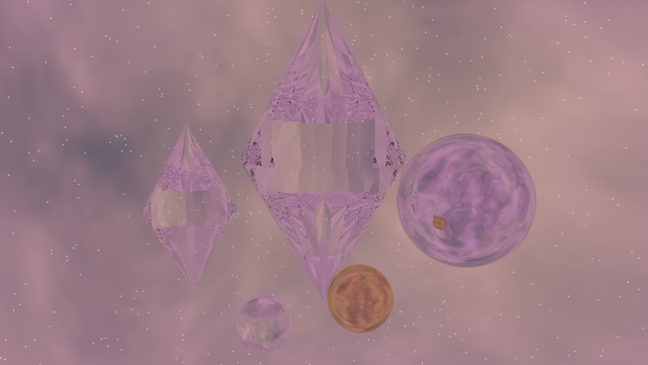
</p>

And since every glitch mode works by distorting reflection/refraction
directions, environment lighting interacts with all of them - here's
`axis-swap-reflect` folding the same scene, turning the mirror sphere's
nebula reflection into a hard-edged crescent void:

<p align="center">
  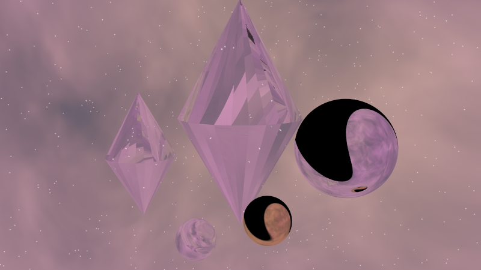
</p>

A real photo works too, of course - the same public-domain NASA Blue Marble
composite used for the sphere texture above, this time as the environment
itself (`scenes/earth_environment.ron`):

<p align="center">
  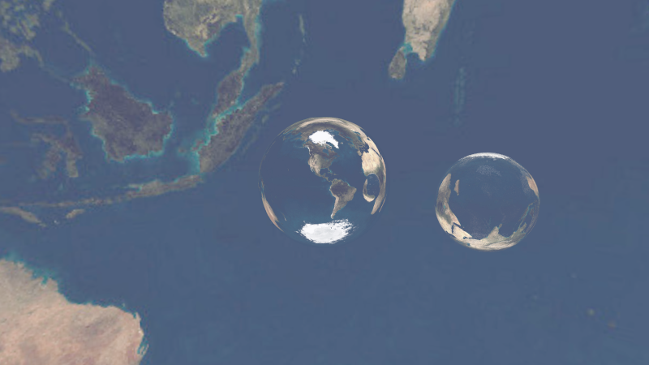
</p>

### Area lights and soft shadows

`reference/MultiReflectionShader.cpp` calls into an `AreaLight` class
(`#include "AreaLight.h"` - referenced but not itself part of what was
preserved in `reference/`) via a `getLightPt` method that picks a jittered
point on the light per ray, gated behind a comment about needing multiple
rays per pixel to pay off. That's the standard Monte Carlo soft-shadow
technique, and this renderer now has its own version: `Light::Rect`, a
finite rectangular panel that picks a fresh random point on itself for
every shadow ray. With enough samples per pixel, the many
slightly-different shadow rays average into a soft penumbra instead of one
hard edge - the same reason antialiasing falls out for free from
multisampling.

Same scene, same light position and roughly the same brightness, only the
light's shape changes:

<p align="center">
  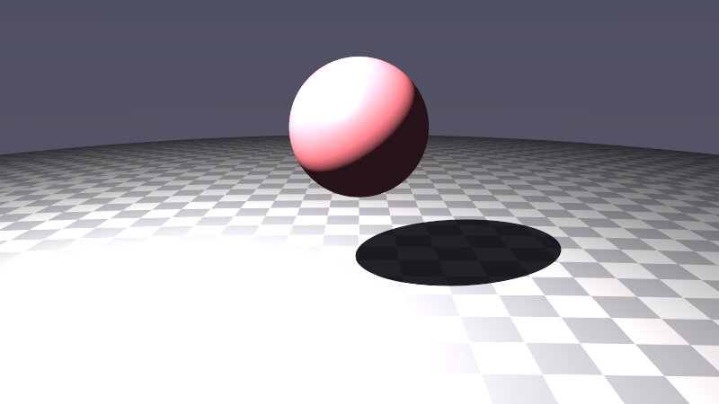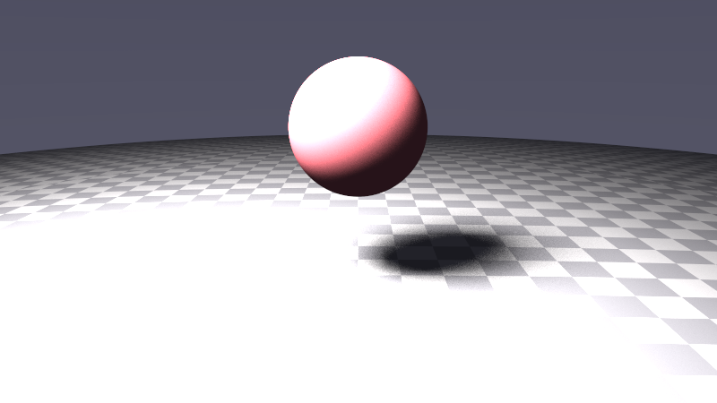
</p>

Left: `Point` (an infinitesimal source - every shadow ray aims at the exact
same location, so the shadow boundary is razor-sharp no matter the sample
count). Right: `Rect` (`scenes/area_light_soft_shadow.ron`) - a proper
penumbra, with the expected soft-shadow grain visible at the edge since
each pixel is now averaging over both a different lens/AA offset *and* a
different point on the light.

### Emissive materials

`Material::Emissive { color, intensity }` radiates its own color/texture
regardless of incident light, instead of being shaded by the scene's lights.
There's no full global illumination here (this is still a Whitted-style
direct-lighting tracer), so an emissive surface doesn't cast light onto
*other* objects the way a `Light` does — but seen directly, through glass, or
in a mirror, that's enough for a glowing crystal core:

<p align="center">
  
</p>

`angular-fold` (right) folds the glow's refracted path into a symmetric
petal shape entirely as a side effect of folding the reflection/refraction
angle - not something anyone designed, just what falls out of applying a
literal optical trick to a glowing object seen through glass.

### Turntable animation

`--animate <frames>` orbits the camera once around `look_at` (same height
and radius as the scene's own `look_from`) and encodes the sequence as a
looping animated GIF instead of a still:

```sh
cargo run --release -- scenes/glowing_core.ron --animate 36 --glitch angular-fold -o out.gif
```

<p align="center">
  
</p>

`angular-fold`'s wedge symmetry is locked to world-up, not to the camera - so
orbiting around a faceted crystal cluster reads like a slowly-turning mandala
rather than a fixed decal on the objects:

<p align="center">
  
</p>

`hit-chain-drift` in motion shows a side of the bug stills don't: since it
has no real reflection to fill in a surface's dark side, whichever facets
face away from the single light in this scene go essentially silhouette-
black as the camera orbits past them, alternating with the bright chaotic
patchwork on the lit side - lighting-angle sensitivity that's authentic to
the original bug (there was never a "reflected" fill light, just this
chaotic walk of *direct* light samples), not a rendering artifact:

<p align="center">
  
</p>

It even holds up on a real mesh - the Stanford bunny (69,451 triangles)
under `normal-drift`:

<p align="center">
  
</p>

## Camera projections

`src/camera.rs` used to be a single hard-coded pinhole/perspective camera.
It's now an enum of five, selectable per scene via `camera.kind` (default
`Perspective`, so every scene file written before this field existed keeps
rendering exactly as before - the perspective variant is a straight
byte-identical refactor, checked by a regression test against the original
formula). Non-perspective projections don't have a `vfov` in the perspective
sense, so each one takes the parameter that actually describes it instead of
overloading a field that means something different every time: `Orthographic`
takes `height` (a world-space viewport size, since parallel rays have no
convergence to size instead), `Fisheye`/`Stereographic` take `vfov` but as a
literal angular field of view - up to 360 degrees for a full-sphere image -
rather than perspective's `tan`-based approximation, and `Equirectangular`
takes neither field at all, since it always covers the entire sphere around
the camera regardless of how wide you'd like it to be.

Fisheye and equirectangular in particular reward putting the camera close to
or inside a cluster of objects rather than the usual outside-looking-in
distance perspective scenes favor. `scenes/fisheye_crystal.ron` tucks the
camera right up against the crystal cluster's flank with a 165-degree
equidistant field of view:

<p align="center">
  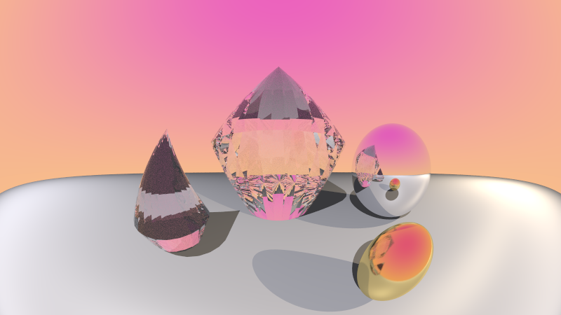
</p>

`scenes/equirect_crystal.ron` sits the camera in the middle of a ring of
crystals and mirror spheres and renders the full 360x180 panorama around it -
objects both ahead of and behind `look_at` land in the same frame, wrapped
across the left/right seam:

<p align="center">
  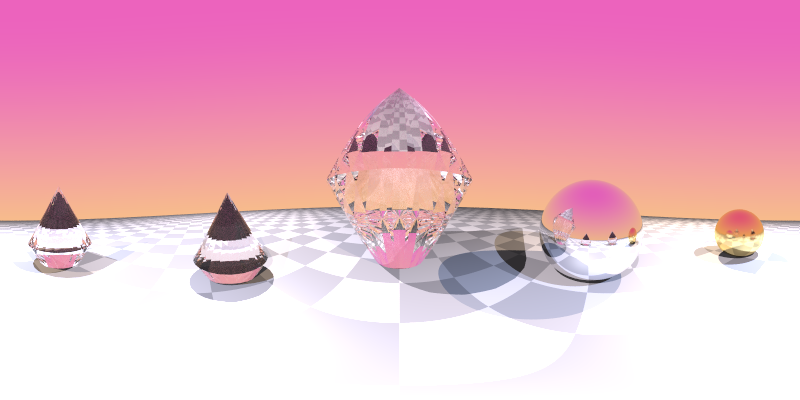
</p>

`scenes/little_planet.ron` uses `Stereographic`: a fisheye variant with a
`r = 2 tan(theta / 2)` radius-to-angle mapping instead of `Fisheye`'s linear
one, which compresses angles well past 90 degrees much harder toward the
frame edge. Point it straight down at a ring of objects on the ground with a
wide enough field of view and the horizon curls into a full circle - the
classic "little planet" trick, produced directly by the camera model instead
of as a post-process on an equirectangular source image:

<p align="center">
  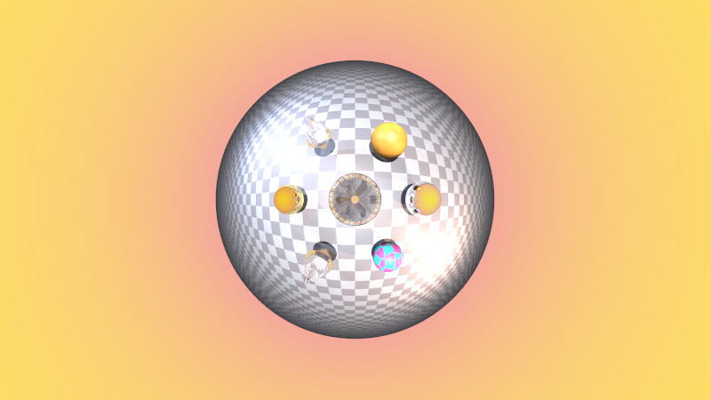
</p>

Non-perspective projections also turn out to be an interesting way to look at
the glitch gallery, since there's no perspective convergence competing with
whatever the glitch is already doing to shape:

| | |
|---|---|
| 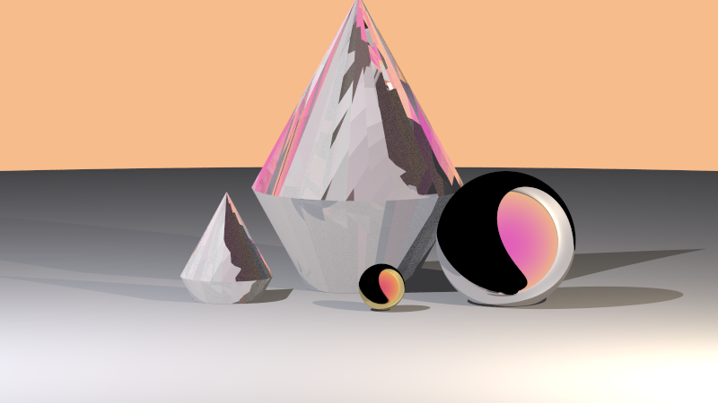 `Orthographic` + `axis-swap-reflect` — parallel rays, no convergence, paired with the cyclic-component-permutation reflection bug: the mirror sphere goes flat black split by a hard color edge instead of the usual mottled faceting. | 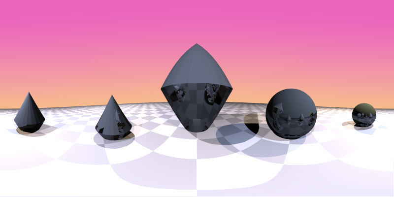 `Equirectangular` + `hit-chain-drift` — the discarded-reflection walk reads as uniformly flat and dark across the whole panorama; without a patterned texture to reveal the walk (contrast with "The real bug" above), every reflective/refractive surface just goes matte. |

### Depth of field

`Perspective` cameras can take `aperture`/`focus_dist`: a thin-lens model
where rays originate from a random point on a lens disk instead of a single
point, all still converging on the same plane at `focus_dist` (`aperture: 0`
- the default - is an exact pinhole, byte-identical to every scene written
before this existed). Standard bokeh:

<p align="center">
  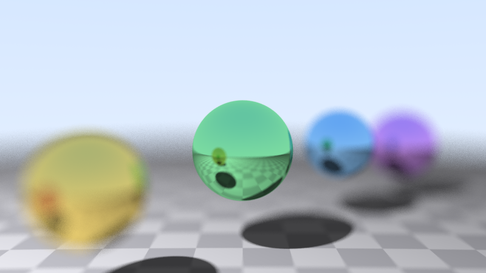
</p>

Paired with `normal-drift`, the blur and the corrupted specular highlights
compound into something closer to bioluminescence than optics:

<p align="center">
  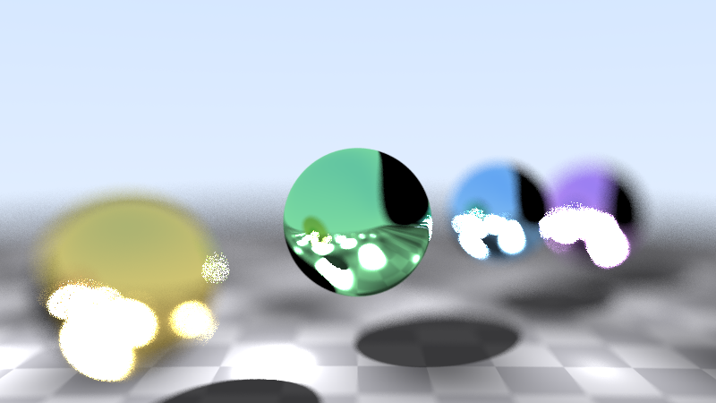
</p>

## Inside the geometry

Every scene so far puts the camera outside a small handful of objects
floating in open space. The glitch modes that corrupt a reflection *axis* or
*hit point* - `hit-chain-drift`, `angular-fold`, `axis-swap-reflect` - only
get to show off what they do to a ray at each bounce, and in open space most
rays only bounce once or twice before escaping to the sky. Put the camera
*inside* a large, irregular, enclosing mesh instead, surrounded by more
reflective/refractive surfaces than it can see past, and every ray is forced
into many more bounces before it can get away - exactly the regime these
bugs are most visible in.

Two new procedurally-generated meshes (same "don't trust hand-derived
winding order" trick as `gen_crystal.rs`: compute each face's normal, flip
it if it points the wrong way):

- `examples/gen_geode.rs` → `assets/geode.obj`: an icosahedron subdivided
  into a geodesic sphere, then nudged in and out by a handful of smooth
  Gaussian radial bumps so it reads as an irregular cave rather than a
  perfect sphere (1,280 triangles).
- `examples/gen_spiral_horn.rs` → `assets/spiral_horn.obj`: a generalized
  cylinder swept along a helical spine, flaring from a closed, tapered tip
  to a wide open bell, with a star/gear-shaped fluted cross-section for
  extra facets (777 triangles). The winding-safety trick gets generalized
  here too - a spiral tube isn't star-shaped around one global center the
  way a bipyramid is, so each face checks its normal against the nearest
  point on the local spine instead of one fixed origin.

Both are large enough, and open enough on the inside, for `scenes/
geode_interior.ron` and `scenes/spiral_horn_interior.ron` to put the camera
*inside* them, surrounded by a small cluster of Dielectric crystals and
Metal mirror spheres.

One dead end worth documenting: an early version of `geode_interior.ron`
made the cave wall itself Metal, on the theory that "reflection/refraction
should dominate the interior-facing surfaces." It rendered pure black. This
renderer's `Metal` material has no direct-light term at all (only
`Lambertian` samples the scene's point lights) - it only ever shows *reflected*
light, so a fully-enclosed all-Metal shell has nothing to reflect and no way
out to the sky. The fix, and the actual point of these scenes: the enclosing
mesh is Lambertian and boldly textured (so it's genuinely lit, and so a
glitch mode corrupting the hit point has something visibly different to land
on at each point), while the Dielectric/Metal objects clustered around the
camera do the reflecting.

<p align="center">
  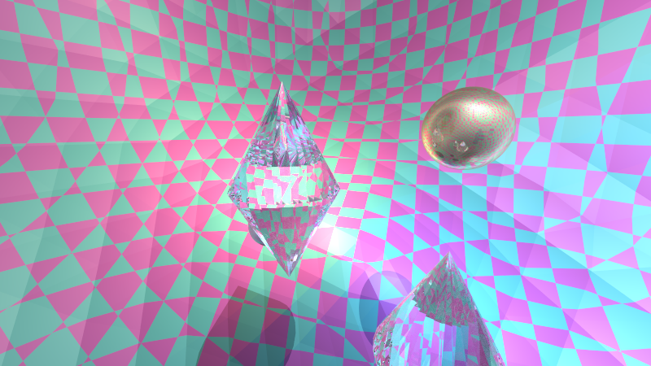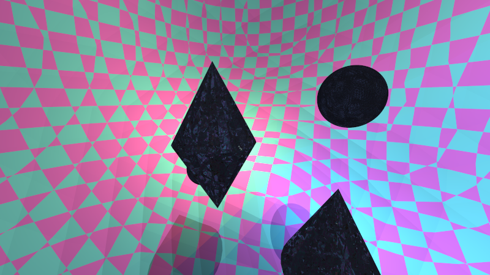
</p>

`hit-chain-drift` (above right) is the standout: the crystal collapses into
a jumbled, dark mosaic of tiny fragments, far busier than the same bug on
the open-space showcase scene (compare the "textured" pair earlier in this
README) - there's simply more nearby geometry for the shading point's
chaotic walk to land on between light samples. `axis-swap-reflect` picks a
different victim in the same scene - the mirror sphere, which the swapped
reflection axis carves a sharp black crescent out of:

<p align="center">
  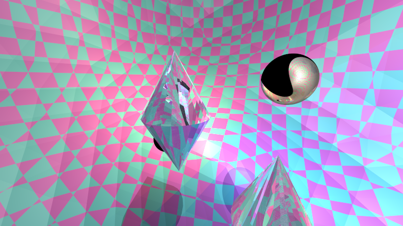
</p>

The spiral horn scene puts the camera deep in the throat instead, looking
back out through the twisting, fluted walls - the same `hit-chain-drift` bug
hitting a differently-shaped complex enclosure, for comparison. This pairing
turned out to be the closest the whole gallery gets to the original 2013
reference photo that started this project: the fluted geometry alone (left,
*zero* glitch applied) already produces sharp angular color wedges, and
`hit-chain-drift` (right) pushes the crystal into the same dense fractured-
facet density as the original:

<p align="center">
  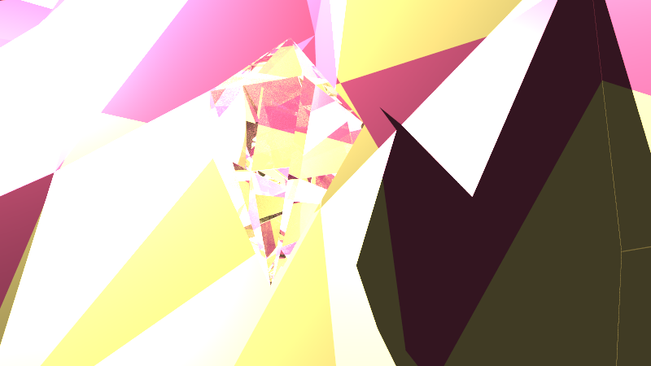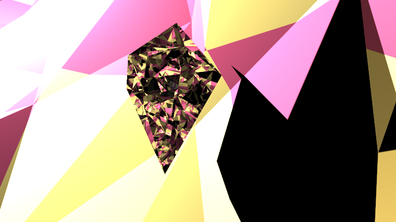
</p>

`angular-fold` on the same throat gives a cleaner, more crystalline read -
bold flat color wedges reflected across the crystal's facets rather than
mosaic fragmentation:

<p align="center">
  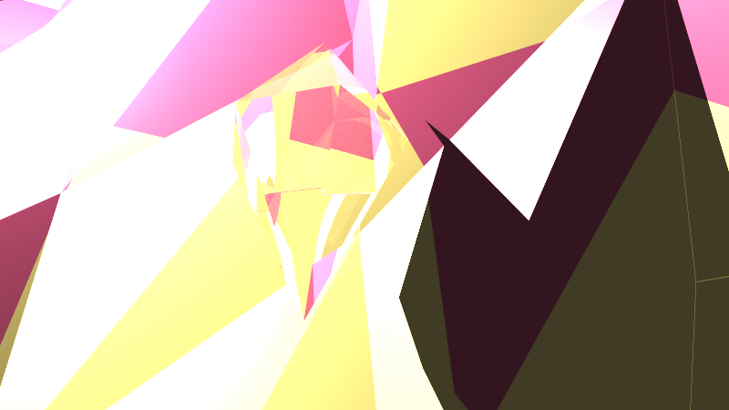
</p>

A `--animate` turntable of this scene is honest about the horn being a
curved tube, not a fully enclosing shell like the geode: some frames stay
immersed in the fluted walls, others swing wide toward open sky as the
orbit clears the throat - not a bug, just what an orbiting camera does
inside an asymmetric space:

<p align="center">
  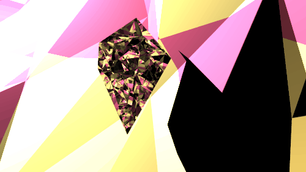
</p>

Render either with:

```sh
cargo run --release -- scenes/geode_interior.ron --glitch hit-chain-drift -o renders/out.png
cargo run --release -- scenes/spiral_horn_interior.ron --glitch axis-swap-reflect -o renders/out.png
```

Or regenerate the meshes themselves (parameters are positional CLI args, see
each file's `main` for defaults):

```sh
cargo run --release --example gen_geode -- 3 assets/geode.obj
cargo run --release --example gen_spiral_horn -- 7 56 assets/spiral_horn.obj
```

## Capstone

`scenes/capstone.ron` puts (almost) everything above in one frame: the
procedural nebula environment map, a `Rect` area light casting a real soft
shadow, an `Emissive` glowing core sealed inside a `Dielectric` crystal
shell, a `Metal` sphere wearing a real photo *and* reflecting the nebula
around it at the same time, the procedurally-generated spiral horn wearing
that same photo along its own distinct UV wrap, and a touch of
depth-of-field:

<p align="center">
  
</p>

Every one of those features works by shading a ray hit or bending a
reflection/refraction direction, so a glitch mode reaches all of them at
once. `axis-swap-reflect` again:

<p align="center">
  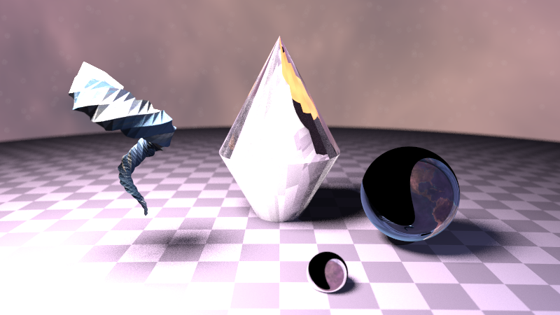
</p>

And turned into a turntable, camera orbiting once around the whole
composition:

<p align="center">
  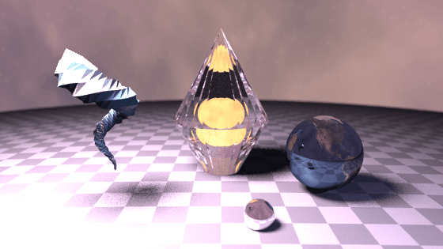
</p>

## Usage

```sh
# Build
cargo build --release

# No arguments: renders the full built-in demo (baseline scenes + every
# glitch mode) into renders/
cargo run --release

# Render a scene file
cargo run --release -- scenes/reflection_demo.ron -o renders/out.png

# ...with a specific glitch mode
cargo run --release -- scenes/crystal_showcase.ron --glitch axis-swap-reflect -o renders/out.png

# ...or every glitch mode at once, one file per mode
cargo run --release -- scenes/crystal_showcase.ron --gallery -o renders/gallery/

# ...or a looping turntable GIF, camera orbiting once around look_at
cargo run --release -- scenes/glowing_core.ron --animate 36 --glitch angular-fold -o out.gif

# Options
cargo run --release -- --help
```

Key flags: `--width`/`--height`/`--aspect`, `--samples` (antialiasing /
glass noise quality), `--depth` (max bounce count), `--glitch <mode>`,
`--animate <frames>` (turntable GIF instead of a still).

## Scene format

Scenes are [RON](https://github.com/ron-rs/ron) files - see
`scenes/*.ron` for complete examples, or `src/scene_desc.rs` for the format
definition. Shape:

```ron
(
    camera: (look_from: (0.0, 0.8, 2.5), look_at: (0.0, 0.0, -1.0), vfov: 45.0),
    sky_bottom: (1.0, 1.0, 1.0),   // optional, defaults to a pale blue sky
    sky_top: (0.5, 0.7, 1.0),      // optional
    environment: Some(Image("assets/textures/nebula.png")), // optional, overrides sky_bottom/sky_top
    lights: [
        Point(position: (-4.0, 5.0, 2.0), color: (1.0, 1.0, 1.0), intensity: 40.0),
        // Rect(center: .., u_axis: .., v_axis: .., color: .., intensity: ..) also works -
        // a finite area light casting soft shadows, see "Area lights and soft shadows" above.
    ],
    objects: [
        Sphere(center: (0.0, -100.5, -1.0), radius: 100.0, material: Lambertian(albedo: Solid((0.6, 0.6, 0.65)))),
        Sphere(center: (0.0, 0.0, -1.2), radius: 0.5, material: Metal(albedo: Checker(a: (0.9, 0.1, 0.1), b: (1.0, 1.0, 1.0), scale: 4.0), fuzz: 0.02)),
        Sphere(center: (1.1, 0.0, -1.6), radius: 0.5, material: Dielectric(ior: 1.5)),
        Mesh(path: "assets/crystal.obj", material: Dielectric(ior: 1.8), scale: 1.0, translate: (0.0, 0.0, -1.0)),
    ],
)
```

`albedo` takes a `Texture`: `Solid((r,g,b))`, `Checker(a:.., b:.., scale:..)`,
`Stripes(a:.., b:.., scale:.., axis:0|1|2)`, `Gradient(bottom:.., top:.., y0:.., y1:..)`,
`Noise(color:.., scale:.., octaves:..)`, or `Image("path/to/file.png")` (UV-mapped,
bilinearly filtered - see "Textures" above for which primitives compute real UVs).

`camera` also takes an optional `kind` (`Perspective` by default) plus
`height`, only meaningful for `Orthographic` - see "Camera projections"
above. `scenes/fisheye_crystal.ron`, `scenes/equirect_crystal.ron`,
`scenes/orthographic_crystal.ron`, and `scenes/little_planet.ron` are
complete examples of each non-default kind.

`environment` takes the same `Texture` grammar as `albedo` above (most
usefully `Image("path.png")`) and, when set, replaces `sky_bottom`/`sky_top`
as whatever every ray that escapes the scene sees - see "Environment
lighting" above. `scenes/nebula_crystals.ron` and
`scenes/earth_environment.ron` are complete examples.

## Project layout

- `src/vec3.rs`, `src/ray.rs` - core math
- `src/camera.rs`, `src/light.rs`, `src/material.rs`, `src/texture.rs`, `src/sphere.rs`, `src/triangle.rs` - scene primitives
- `src/hittable.rs`, `src/aabb.rs`, `src/bvh.rs` - intersection + acceleration structure
- `src/mesh.rs` - hand-rolled OBJ loader
- `src/scene.rs`, `src/scene_desc.rs` - runtime scene representation and its RON (de)serialization
- `src/render.rs` - the shader: recursive ray-color evaluation, antialiasing, multithreading (rayon)
- `src/glitch.rs` - the glitch gallery: every deliberate physical-inaccuracy mode, with rationale
- `examples/gen_crystal.rs` - procedurally generates the faceted "gem" test meshes under `assets/`
- `examples/gen_geode.rs`, `examples/gen_spiral_horn.rs` - procedurally generate the enclosing "cave" and "horn" meshes used by the camera-inside-the-geometry scenes
- `examples/gen_starfield.rs` - bakes the procedural nebula/starfield environment map under `assets/textures/`
- `scenes/*.ron` - example scene files
- `assets/` - OBJ test meshes (procedural crystals, geode, spiral horn, Stanford bunny) and `assets/textures/` - image textures; see `assets/README.md` for what's this project's own work vs. sourced elsewhere, and licensing/provenance for each
- `gallery/` - rendered PNGs/GIFs referenced by this README (every image here was produced by this renderer, not hand-picked from elsewhere)
- `reference/` - the actual 2013 C++ source behind the whole project, kept verbatim - see `reference/README.md`

## Tests

```sh
cargo test --release
```
